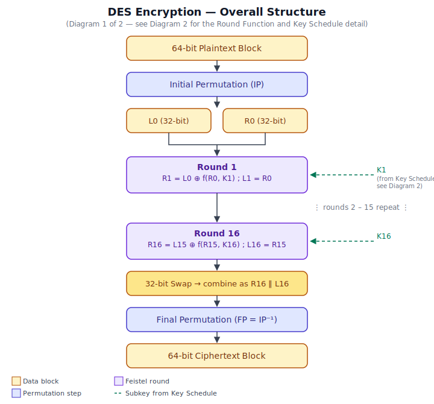
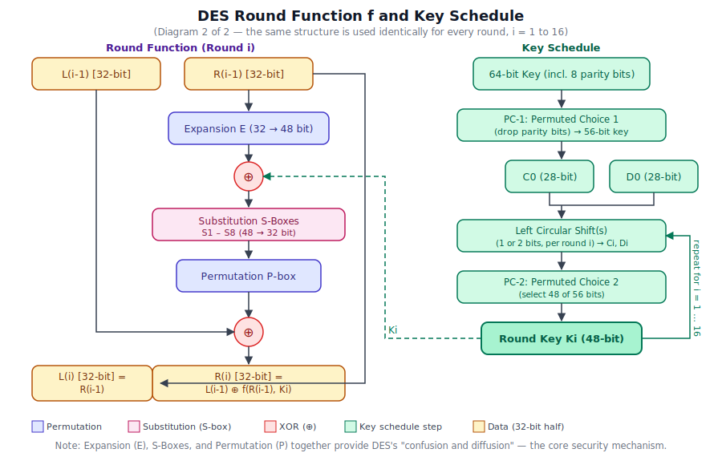

# Assignment: DES

## Course / Module
ICT 4105 - Cryptography and Cyber Law by [Prof. Dr. Ziaur Rahman]([https://google.com](https://rahmanziaur.github.io/))

Develop a Java application that implements the **Data Encryption Standard (DES)** algorithm to perform both **encryption** and **decryption** of text messages. The program should provide a simple user interface where users can enter either a **plaintext** and a **secret key** to generate the corresponding **ciphertext**, or a **ciphertext** and the same **secret key** to recover the original plaintext. The application should validate that the DES key is exactly **8 characters (64 bits)**, use Java's built-in Cryptography Architecture (JCA) libraries for DES operations, and display the input and output clearly. The functionality should be similar to the sample online tool provided, allowing users to switch between encryption and decryption modes while demonstrating the practical application of symmetric-key cryptography. The program should be well-structured using appropriate classes and methods, include proper exception handling, and follow object-oriented programming principles.

Submit via Google Classroom using Java.

Here is a sample DES Page: https://rahmanziaur.github.io/Crypto2025Zia/crypto.html.
Here is another popular site: https://www.cryptool.org/en/cto/

---
## Sample Input

**Key (used for all 3 test cases):**
- ASCII: `DESKEY12`
- Hex: `4445534B45593132`

| No. | Plaintext |
|-----|-----------|
| 1 | `HELLO123` |
| 2 | `Computer Network Security` |
| 3 | `DES Algorithm Test 2026!` |

## Sample Output

Your program's output should match the following exactly (mode = ECB, padding = PKCS7):

| No. | Plaintext | Ciphertext (Hex) | Decrypted Text |
|-----|-----------|-------------------|-----------------|
| 1 | `HELLO123` | `A21A616C70AFAB9A6738237FA5B0F65E` | `HELLO123` |
| 2 | `Computer Network Security` | `3A1C6C41ED0B0497890E7DFCA039FAFA1A288EA2E8A3248D78DC6B23174DC2BE` | `Computer Network Security` |
| 3 | `DES Algorithm Test 2026!` | `F3BF3CA7C558199E17264408F78409BC5C7D04671BE5E9296738237FA5B0F65E` | `DES Algorithm Test 2026!` |
---

## Background: What is DES and How Does It Work?

Read this section carefully before starting the assignment — it explains the algorithm you will be using.

### What is DES?
The **Data Encryption Standard (DES)** is a **symmetric-key block cipher** developed by IBM in the 1970s and adopted in 1977 as a U.S. federal standard (FIPS 46) for protecting electronic data. "Symmetric-key" means the **same secret key** is used for both encryption and decryption. "Block cipher" means DES does not encrypt data one bit or character at a time — instead, it processes data in **fixed-size 64-bit blocks**.

- **Block size:** 64 bits (8 bytes) of plaintext at a time
- **Key size:** 64 bits in storage, but only **56 bits** are actually used as key material — the other 8 bits are parity bits (one per byte) used for error-checking, not security
- **Structure:** A 16-round **Feistel network** (explained below)
- **Status today:** DES's 56-bit effective key is small enough to be broken by brute force with modern computing power, so it is no longer considered secure for real-world use (Triple DES and AES replaced it). It remains, however, one of the best algorithms to *study*, because its design introduced the Feistel network — a structure still used conceptually in modern cryptography.

### The Big Idea: A Feistel Network
DES repeatedly applies the same transformation, called a **round**, 16 times in sequence, mixing the data with a different piece of the secret key (a **subkey**) each round. Each round is reversible by design, which is what allows the *same* algorithm structure to perform both encryption and decryption — only the order of the subkeys changes.

### How DES Encryption Works — Step by Step

**Step 1 — Initial Permutation (IP).**
The 64-bit plaintext block is reordered according to a fixed, publicly known permutation table. This step has no key dependence — it just rearranges bits into a layout that was convenient for early hardware implementations.

**Step 2 — Split into two halves.**
The permuted 64-bit block is divided into two 32-bit halves: **Left (L0)** and **Right (R0)**.

**Step 3 — 16 rounds of the Feistel function.**
For each round *i* = 1 to 16, the algorithm computes:
```
R(i) = L(i-1) XOR f( R(i-1), Ki )
L(i) = R(i-1)
```
where `Ki` is the round's unique 48-bit subkey (see Key Schedule below), and `f` — the **round function** — itself consists of four sub-steps:

  a. **Expansion (E):** the 32-bit `R(i-1)` is expanded to 48 bits by duplicating certain bits according to a fixed expansion table, so it can be combined with the 48-bit subkey.

  b. **Key mixing:** the expanded 48-bit value is XORed with the round's 48-bit subkey `Ki`.

  c. **Substitution (S-Boxes):** the 48-bit result is split into eight 6-bit groups. Each group passes through its own substitution box (`S1` through `S8`), which maps it to a 4-bit output — yielding 32 bits in total. This non-linear substitution is what gives DES its **confusion** (it hides the relationship between key and ciphertext).

  d. **Permutation (P-box):** the resulting 32 bits are permuted again using a fixed table, spreading each S-box's influence across the next round. This provides **diffusion** (a single input bit affects many output bits).

**Step 4 — Final swap.**
After round 16, the two halves are swapped one last time, producing `R16 ‖ L16` (note the order — not `L16 ‖ R16`). This deliberate "undo" of the swap is what makes the very same round structure reusable for decryption.

**Step 5 — Final Permutation (FP).**
The swapped 64-bit value passes through the Final Permutation, which is the exact mathematical inverse of the Initial Permutation from Step 1. The result is the final **64-bit ciphertext block**.

**See Diagram 1 below** for a visual walkthrough of these five steps.

### The Key Schedule — Generating 16 Subkeys from One Key
1. The 64-bit key has its 8 parity bits removed using **Permuted Choice 1 (PC-1)**, leaving a 56-bit key.
2. This 56-bit value is split into two 28-bit halves, `C0` and `D0`.
3. For each round *i* (1 to 16), both halves are **left-circular-shifted** by 1 or 2 bits (the exact shift schedule is fixed by the standard) to produce `Ci` and `Di`.
4. **Permuted Choice 2 (PC-2)** selects and permutes 48 of these 56 bits to produce that round's subkey `Ki`.
5. This repeats for all 16 rounds, producing `K1` through `K16` — each round gets its own unique subkey, even though they all derive from the same original key.

**See Diagram 2 below** for the round function and key schedule shown together.

### How Decryption Works
DES decryption uses the **exact same algorithm and structure** as encryption. The only difference is that the 16 round keys are applied in **reverse order**: `K16` first, then `K15`, … down to `K1`. This symmetry is a direct, elegant benefit of the Feistel network design — you don't need a separate decryption algorithm at all.

### Diagram 1 — Overall DES Structure



### Diagram 2 — Round Function (f) and Key Schedule Detail



---

## Objective
This assignment assesses your ability to:
- Use a standard cryptographic algorithm (DES) correctly within a program
- Work with binary/hexadecimal data, byte encoding, and block cipher padding
- Implement a program with two complementary operations (encryption and decryption) that correctly reverse each other
- Validate your program's correctness against known, verifiable test cases

## Task Description
Write a single program that implements **DES (Data Encryption Standard)** encryption and decryption.

Your program must:
1. Accept a **plaintext** string and a **secret key** as input.
2. **Encrypt** the plaintext into ciphertext using DES.
3. **Decrypt** the resulting ciphertext back into the original plaintext, using the same key.
4. Run this encrypt → decrypt cycle on **all 3 sample plaintexts** provided below, using the same key for each, and print the plaintext, the ciphertext (in hexadecimal), and the decrypted text for each one.
5. Confirm (programmatically or visually) that each decrypted result exactly matches the original plaintext.

### DES Specification for This Assignment
- **Algorithm:** DES (single DES, not Triple DES)
- **Mode of operation:** ECB (Electronic Codebook)
- **Key size:** 8 bytes (64 bits — the standard DES key length; 8 bits are parity, giving 56 effective key bits)
- **Padding:** PKCS5/PKCS7 padding (pad the plaintext so its length is a multiple of the 8-byte DES block size before encrypting; remove the padding after decrypting)
- **Ciphertext output format:** Hexadecimal string (uppercase)

> You are **not required to implement the DES algorithm's internal rounds, S-boxes, or permutation tables from scratch.** Use your language's standard or widely-used cryptographic library (see suggestions below) to perform the actual DES operations. Your task is to correctly *use* the algorithm, handle key/data encoding, apply padding, and structure a working encrypt/decrypt program — not to reimplement the cipher internals.

### Suggested Libraries by Language
| Language | Library |
|----------|---------|
| Python | `pycryptodome` (`from Crypto.Cipher import DES`) |
| Java | `javax.crypto.Cipher` (`"DES/ECB/PKCS5Padding"`) |
| C# | `System.Security.Cryptography.DESCryptoServiceProvider` |
| JavaScript (Node.js) | built-in `crypto` module (`crypto.createCipheriv('des-ecb', ...)`) |
| C / C++ | OpenSSL `libcrypto` (`EVP_des_ecb`) |

## Requirements
- You may use **any programming language**, provided it has access to a DES implementation (standard library or a well-known cryptography package).
- Implement **two distinct functions/methods**: one for encryption, one for decryption. Do not hardcode ciphertext values — they must be computed by your encryption function.
- Your program must process **all 3 sample plaintexts** in one execution (use a loop or list/array of inputs — do not duplicate the same code 3 times).
- Output must clearly display, for each of the 3 inputs:
  - The original plaintext
  - The key used
  - The resulting ciphertext (hex)
  - The decrypted text (recovered from the ciphertext)
- Apply and remove padding correctly so plaintexts of any length (not just multiples of 8 bytes) are handled.
- Include reasonable code comments explaining each step (key setup, padding, encryption, decryption, unpadding).
- Code should run without errors and reproduce the exact sample output below.

**Notes:**
- Test case 1 is exactly 8 bytes long, so PKCS7 padding adds one full extra block (16 bytes / 32 hex chars of ciphertext).
- Test cases 2 and 3 are longer and pad up to the next multiple of 8 bytes.
- If your output ciphertext differs from the table above, double-check: key encoding (ASCII vs. hex), padding scheme (must be PKCS5/PKCS7), mode (must be ECB), and hex case (uppercase, no `0x` prefix or spaces).

## Instructions for Submission
1. Write your program in a single source file (e.g., `des_cipher.py`, `DesCipher.java`, `des_cipher.c`).
2. Test your program against all 3 sample inputs above using the given key and confirm your output matches the sample output exactly.
3. Add comments to your code explaining key handling, padding, encryption, and decryption steps.
4. Submit:
   - Your source code file
   - A short text file or console screenshot showing the program's output for all 3 test cases
   - A note listing which library/package you used (name and version, if applicable)
5. Ensure your program compiles/runs without errors before submission.

## Evaluation Criteria (Total: 10 Marks)

| Criteria | Marks |
|----------|:---:|
| Correct encryption logic (matches expected ciphertext exactly) | 3 |
| Correct decryption logic (recovers original plaintext exactly) | 3 |
| Handles all 3 sample inputs via loop/iteration (no hardcoding/duplication) | 2 |
| Correct padding handling (works for inputs of varying length) | 1 |
| Code clarity, comments, and output formatting | 1 |
| **Total** | **10** |

## Bonus Challenge (Optional, +2 Marks)
Extend your program in **one** of the following ways:
- Switch the mode of operation to **CBC** with a randomly generated IV, printing the IV alongside the ciphertext (note: ciphertext will differ from the sample output above since CBC requires an IV).
- Implement **Triple DES (3DES/DESede)** instead of single DES and re-run all 3 test cases with a 24-byte key, comparing security implications.
- Accept plaintext and key as **runtime user input** rather than hardcoded sample data.

## Academic Integrity
You may discuss DES concepts (Feistel structure, key schedule, block size, padding) with classmates, but the code you submit must be written independently by you. Plagiarized or copy-pasted submissions will receive a zero.
